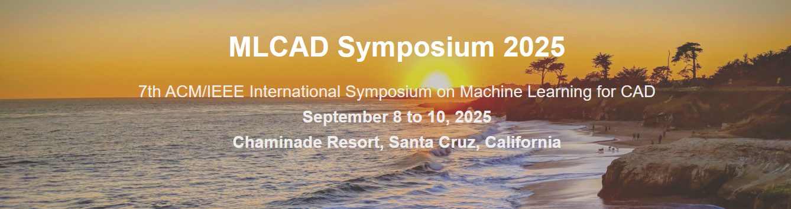
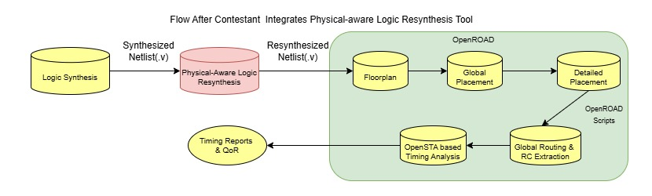

# **ReSynthAI: Physical-Aware Logic Resynthesis for Timing Optimization Using AI**

Join the exciting MLCAD 2025 Contest and showcase your innovative skills in combining artificial intelligence with electronic design automation (EDA). This year's challenge, **ReSynthAI**, focuses on Physical-Aware Logic Resynthesis aimed at timing optimization.

## Contest Overview

Participants are tasked with leveraging AI techniques, including supervised, unsupervised, and reinforcement learning, to perform logic resynthesis. The challenge emphasizes the importance of physical awareness, ensuring that decisions made post-logic synthesis improve the post-global route quality of results as shown in the figure below.  

The transformations at the netlist level include gate sizing, buffer insertion, Vt swaps, gate cloning, and combinational logic restructuring.

### Contest Challenges Include:

- Applying machine learning techniques (supervised, unsupervised, reinforcement learning) for logic resynthesis.
- Ensuring physical awareness in resynthesis and ensuring routability without congestion overflows.
- Demonstrating timing improvements post global route by performing netlist optimizations post logic synthesis. 

## Why Participate?

- Showcase your AI-driven EDA innovations and state-of-the-art algorithms for physical-aware logic resynthesis. 
- Apply for **travel grants** (available for eligible participants) to MLCAD 2025.
- Winners will receive high-performance NVIDIA GPUs as prizes!

## Registration and Important Dates

### Registration

- Registration opens: **March 15, 2025**
- Registration deadline: **April 23, 2025**
- [Register here](https://form.jotform.com/250707549368063) 
## Contest Timeline

| Milestone                 | Date            |
| ------------------------- | --------------- |
| Contest Begins            | April 23, 2025  |
| Registration Closes       | April 23, 2025  |
| Alpha Submission Deadline | May 30, 2025    |
| Beta Submission Deadline  | July 15, 2025   |
| Final Submission Deadline | August 10, 2025 |
| Results Announcement      | September 2025  |

## Prizes

Top-performing teams will receive **NVIDIA GPUs** as awards*! These can be used for further research!

## Contest Details

Problem specification scripts and benchmarks will be available shortly. 

## About MLCAD

The International Workshop on Machine Learning for CAD (MLCAD) is the leading venue dedicated to advancing research at the intersection of machine learning and electronic design automation (EDA). It provides a unique platform for collaboration between academia and industry, fostering innovation and driving progress in AI-driven CAD solutions.

**Join the contest, push the boundaries of EDA, and lead the future of AI in chip design!**

## Acknowledgement

*We thank NVIDIA for sponsoring the contest, GPU awards, and involvement in organizing this contest.

## Contest organizers

| Name                      | Affiliation     |
| ------------------------- | --------------- |
| Atmadip Dey               | ASU             |
| Vikram Gopalakrishnan     | ASU             |
| Rongjian Liang            | NVIDIA          |
| Yanqing Zhang             | NVIDIA          |
| Haoxing (Mark) Ren        | NVIDIA          |
| Vidya A Chhabria          | ASU             |

For questions, reach out to mlcad2025-contest@googlegroups.com
